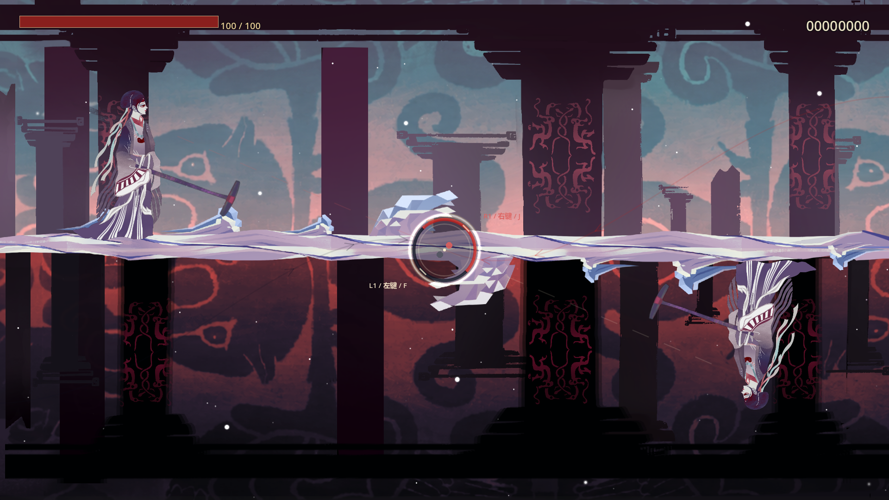

# 导出预览白底修复

2026-09-13，Godot 4.7.2 Compatibility。

## 原因

`screen_half_material_split.gdshader.uid` 与 `screen_half_material_split_live.gdshader.uid` 曾同时使用 `uid://dca4ddyalfe3`。这项冲突在 9 月 11 日的提交中已经存在，不来自本轮音符特效或人物骨骼动画的并行修改。

`s00_grave_background.tres` 的四个生侧图层通过该 UID 引用 `_live.gdshader`。源码运行解析到单侧裁切版本；导出包却解析到通用双贴图版本。后者的 `upper_material` / `lower_material` 未设置，采样返回白色，原本透明的区域也被不透明白块覆盖。因此程序可以正常启动、谱面加载返回 `ready`，运行日志也没有错误，但最终画面错误。

此前构建记录将重复 UID 警告视为不影响启动，没有检查导出包加载正式背景后的像素结果，漏过了此问题。启动成功不再作为背景显示正确的依据。

## 修复

通用双贴图 shader 改用独立 UID，保留生侧 shader 的原 UID 与现有背景引用。清理生侧 shader 的过时双贴图注释，同时让编辑器刷新两个 shader 的缓存元数据。实际着色逻辑、背景布局、人物动画、音符特效和用户谱面均未因此改动。

## 验证

新增 `tests/visual/run_background_shader_tests.gd`。在 Game 目录下，以 Godot 的 `--main-pack <导出EXE>` 加载包内资源，并通过外部测试脚本检查背景引用与实际渲染。编辑器包使用正式 `StudioPreviewSession`，游戏包使用正式 `StageRoot`。

```powershell
& $godotExe --main-pack ../Charts/minghe-chart-studio.exe --rendering-method gl_compatibility --script "$PWD/tests/visual/run_background_shader_tests.gd" -- "$PWD/builds/background-check" "$PWD/../Charts/charts/教程2/song.json"
```

输出目录后可省略谱面参数，使用内置 s08。脚本分别检查两套背景资源的 shader 引用，以及 1920×1080、960×540 下的上下半屏白底覆盖率。

- 旧写谱器包：17 项中 8 项失败，包括四个错误引用、四次半屏白底检查。1920 宽时，上半屏白底占比 87.8%，下半屏 59.9%，截图复现用户反馈。
- 修复后的写谱器、关卡编辑器和本体包：各 17 项全部通过。两侧白色像素占比约 0～0.1%，保留角色与场景中的正常亮部。
- 最终导出没有重复 UID、脚本或资源错误。三个 EXE 另做 Compatibility 图形启动，配套游戏另做真实谱面加载检查。
- 两个编辑器的 `game/` 已同步本体和 DLL。用户工程与发行 ZIP 未改动。

原始日志与各尺寸截图在 `builds/background-fix/`。修复后的写谱器包预览：


