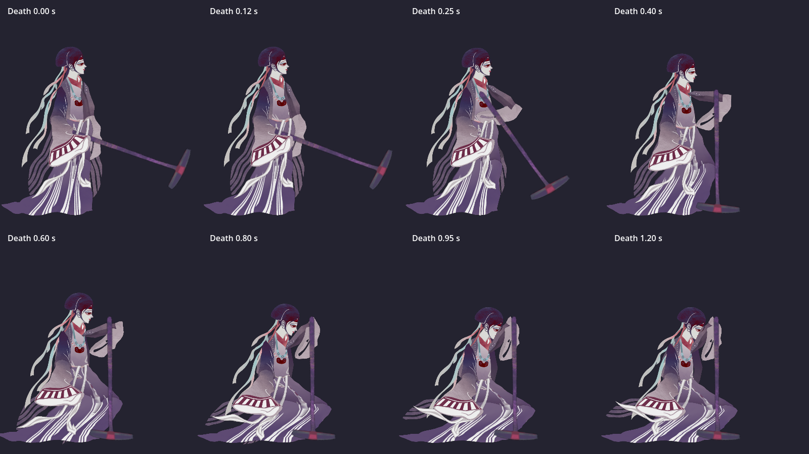

# 灵均角色动画与裙摆

更新：2026-09-13。工程已接入静息、局部受击、支槌屈膝与灰烬消逝，并保留目前的两招攻击与限速。本轮未构建发行程序。

## 静息、受击与死亡

| 动作 | 时长 | 表现与触发 |
| --- | --- | --- |
| `idle` | 4 秒循环 | 约 1.6 秒吸气、2.4 秒呼气；胸肩上提约 5 px，躯干舒展，持槌手臂轻随，发梢、衣带延迟 0.1～0.2 秒跟随。骨盆与双脚稳定，两侧保持同相位。 |
| `hurt` | 0.32 秒 | 前 0.06 秒胸肩收紧、头颈避让，随后恢复；静息与攻击中均可叠加，基础动作继续推进。 |
| `death` | 1.2 秒 | 先失力，0.4 秒时槌头接地，随后屈膝垂首，最后衣料回落。 |
| 灰烬消逝 | 死亡后 1.4～2.05 秒 | 跪姿停留 0.2 秒后，以原角色颜色的薄片与细灰消散，槌和衣料一并消失。 |

受击只读取实际扣血：音符抵达使用音符阵营，机制失败使用判定记录阵营，乱按使用输入阵营；SU 来源作用于双方。零伤害、恢复魂火和重复伤害组不会额外触发。同侧受击未结束时不重启动作，也不积压补播，但真实扣血继续进行。

致命伤害优先于受击，同时接管双方动作。死亡时停止出招；正常通关、主动退出和非致死调试模式不会触发死亡。`StageSession.failure_visual_settle_sec` 默认 2.1 秒，与原物理收尾时长取较大值后进入结算；此参数属于会话表现，不进入判定规则和 Replay 哈希。

基础动画使用 Spine 轨道 0，局部受击使用轨道 1 的 `set_additive(true)`。基础动画完整设置受击涉及的骨骼属性，避免重复采样积累偏移。攻击收招结束后，以 0.15 秒混合进入当前歌曲相位的静息。

静息受击使用同一局部动作的 1.2 倍幅度，躯干收身峰值约 3.6°；攻击中维持 1 倍、约 3°，保持挥槌轨迹。受击结束后继续原有呼吸相位，不重新开始静息循环。呼吸像素幅度以当前 0.405 角色缩放及设计画布计。

所有正式灵均实例改为由歌曲时间驱动 Spine。伤害通知先按领域时间排队，推进到事件时刻再切换动作；大步定位同样跨过真实事件边界和收招完成时刻。暂停冻结，重试清除受击、死亡、网格修形及碎片透明度，恢复静息。预览不增加整曲逐帧重演。



## 攻击行为

首次按下从重定时后的 0.46 秒位置起播，槌子位于身体右侧偏上，基准速度下保留约 90ms 的可见下砸轨迹。压缩举槌准备、延长真正下劈，整招仍为 1.1 秒；不恢复完整前摇。下击使用原动画第二招，上挑使用原动画第一招。

- 长按使用 `attack_loop` 交替播放两招。通过三次 Hermite 插值匹配衔接两端的姿势和速度，从本招余势进入下一招蓄力，取消中间的站姿停顿；挥击段保留原速度变化。
- 松开以 0.10 秒混合转到同相位的 `attack`，只收完当前一招并回到站姿。两条动画共用 2.2 秒时间轴，每段 1.1 秒，便于准确接续。
- 允许重新出招时，从下击末段起播，未完成动作采用 0.025 秒混合，避免旧收招遮住下砸轨迹。限速内再次按下不重启当前动作，不积压补播。若随后持续按住，在收招和冷却都完成时恢复循环。
- 生、死两侧分别读取玩法快照中的 `life_frequency_hz` / `death_frequency_hz`。改频只调整播放倍率，保留动作相位；不读取点按次数作为加速来源。
- 正式游戏与写谱预览均按歌曲时间、输入边界及续招时刻推进灵均。暂停冻结，回拖和重试清除轨道与限速状态后重演。跨过混合结束时使用零时间更新清理旧轨道。

这些修改只影响角色表现。每次玩家输入仍正常发波、判定、计分，Replay 数据不变。

### 速度与敲击上限

表现节点 Inspector 的 `Actor Rhythm` 提供以下参数：

| 参数 | 默认值 | 作用 |
| --- | --- | --- |
| `attack_reference_hz` | 3 Hz | 对应原速的发波频率 |
| `attack_rate_per_hz` | 0.15 | 每增减 1 Hz 的倍率变化 |
| `attack_min_rate` / `attack_max_rate` | 0.65 / 1.65 | 播放倍率上下限 |
| `attack_max_strikes_per_sec` | 2 次/秒 | 点按与长按共用的敲击上限 |
| `attack_release_mix_sec` | 0.10 秒 | 松开进入收招的混合时长 |
| `attack_restart_mix_sec` | 0.025 秒 | 重按衔接时长，应在下砸完成前结束 |

当前 1／3／7 Hz 分别对应 0.7／1／1.6 倍速度。长按还按相邻挥击的最短动画间隔限制倍率；快速连按则同时检查上次出招与上次实际挥击的时间，不能在循环刚敲下后重按来绕过上限。定位只记录最近一次挥击，不逐圈补播特效。

### 角色素材约定

`lingjun_actor.tscn` 的元数据对应派生素材：

- `attack_segments = 2`：`attack` 的等长收招段数，各段末尾须回到站姿。
- `attack_loop = "attack_loop"`：连续衔接动画，与 `attack` 保持同一时间轴。
- `attack_start_sec = 0.46`：从右侧抬槌姿势开始下砸。
- `attack_hit_times = [0.55, 1.5]`：每轮下击、上挑的挥击时刻，仅用于表现限速。
- `idle`、`hurt`、`death`：三类动作的资源名称。`Ashes` 子节点负责死亡末姿的碎片表现。

替换素材时同步以上配置。简单单招素材可以省略这些元数据，沿用 `attack` 入口。

## 素材与裙摆绑定

`assets/character/lingjun/juese.*` 和 `lingjun.tres` 是保留的原始导出资源。角色场景使用 `lingjun_gameplay.tres`，引用派生的 `lingjun_gameplay.spine-json`、`lingjun_gameplay.atlas` 与 `lingjun_skirt.png`。原人物图集仍共享使用。

生成器在站姿中单独绘制原来的 `5`、`2`、`-7`、`-9` 四块衣料，将组合结果烘焙成透明裙面。原拆片留下的窄透明内缝使用两侧衣料颜色接合，保留下摆外轮廓。派生资源复用原 `2` 槽位放置裙面，清除另外三片的附件；槽位顺序保持不变，腰饰、飘带、手臂和武器仍独立绘制。

裙面为 117 顶点、192 三角形的连续网格，原四片合计为 263 顶点、335 三角形。五个控制骨骼分别为：

| 骨骼 | 作用 |
| --- | --- |
| `skirt_waist` | 跟随骨盆 `bone3`，固定裙腰 |
| `skirt_body` | 裙身随腰部移动，平滑传递到下摆 |
| `skirt_back` | 后下摆保留拖地轮廓 |
| `skirt_middle` | 维持中间连续布面，随迈步展开 |
| `skirt_front` | 从大腿到下摆共同包住前膝、前脚，保留少量布料松量 |

腿部 IK 只在生成资源时作为运动参考，使用 `applied_pose` 读取约束求解后的前膝和前脚。前侧衣料从大腿处就开始展开，两条动画的衔接与收招段都按实际 IK 路径采样，避免裙底展开而膝部仍内凹，或收腿时裙面提前缩回。生成结果保存为裙骨关键帧。运行时没有布料模拟、图片烘焙或网格重建。原衣料纹样与配色继续使用，当前方案服务于现有视角和攻击动作。

屈膝另有裙骨轨道与附件 deform：裙腰随骨盆降低，前缘按求解后的膝部位置形成连续圆弧，下摆铺开并留在地面。腰间长绦和长发末段逐节弯向身后，避免穿地。支槌时使用生成阶段的两段手臂求解，保持前脚与接地后的槌头固定，并维持手掌的握柄位置。

`lingjun_death.png` 是完整死亡末姿的透明贴图，`lingjun_ashes.tscn` 保存其坐标范围。碎片复用音符的 Voronoi 网格生成方法，使用 48 块薄片与 80 个灰点；每个实例独立保存材质时间，沿所属世界的上方飘散。正式游戏不抓屏、不创建逐角色 SubViewport。灰烬 shader 加入现有关卡材质预热流程。

## 重新生成与调整

在 Game 目录执行：

```powershell
& 'F:/godot 4.7.2/Godot_v4.7.2-stable_win64_console.exe' --path . --script tools/generate_lingjun_gameplay.gd --rendering-method gl_compatibility
& 'F:/godot 4.7.2/Godot_v4.7.2-stable_win64_console.exe' --headless --path . --editor --import --quit
```

第一条需要实际图形渲染，不能使用 `--headless`。生成器对应当前 Spine 4.3 导出中的骨骼命名及 `bone2` 的 0.2 缩放；重新导出时保留这些名称和坐标基准。Godot 实例的 Y 轴向下，写回 Spine JSON 的坐标需转换为 Y 轴向上。

片段范围、起手与收招时长、等长段落时长和网格密度位于生成器开头；静息、受击和屈膝姿势位于 `tools/lingjun_rest_animations.gd`，裙骨与屈膝修形位于生成器的 `_animate_skirt_clip()` 和 `_kneeling_deform()`。生成器同时更新死亡末姿贴图和灰烬场景，替换角色素材后须一起重新生成，避免完整骨骼切换到碎片时轮廓不一致。

灰烬子节点的 `start_sec` / `duration_sec` 默认 1.4 / 0.65 秒。若调整消逝时长，同步调整会话的 `failure_visual_settle_sec`，保留末尾停留时间。调整后须检查完整动作与混合过程；新视角、裙内侧或新服装仍需对应素材。

## 验证

- `tests/integration/stage/run_lingjun_attack_tests.gd`：首击跳过前摇、两招连续衔接、分段收招、独立变速、倍率与点按限速、暂停、循环接缝和定位重演，32 项检查（包含重按混合须在下砸完成前结束）。
- `tests/integration/stage/run_lingjun_state_tests.gd`：37 项检查，覆盖静息胸肩幅度、静息受击叠加、领域伤害来源、死亡接管、槌头/前脚支撑、灰烬、结算等待、暂停与定位。
- `tests/integration/stage/run_lingjun_skirt_tests.gd`：攻击、循环、静息、死亡及跨动作混合，共 2,282 个姿势；检查实际 deform、顶点、附件范围、翻折及前膝和前脚的纹理覆盖。
- `tests/editor/run_scene_binding_tests.gd`：59 项场景接入检查；恢复时比较轨道、混合和实际骨骼姿态。
- `tests/visual/capture_lingjun_rhythm.gd`：实际 Compatibility 渲染 330 帧，对照 1／3／7 Hz，覆盖轻按、持续敲击、每秒点按 10 次和松开收招。输出 `build/lingjun/rhythm-frames/`。
- `tests/visual/capture_lingjun_attack.gd`：原素材与独立收招参考、1920/1280 双侧样张；`-- --movie` 使用正式角色场景与播放入口。
- `tests/visual/capture_lingjun_states.gd`：Compatibility 实际渲染死亡关键姿势、1920/1280 双侧消逝阶段；`-- --movie` 生成静息、攻击中受击与死亡的三列动画；`-- --rest-movie` 单独对照静息、静息受击与攻击受击；`-- --stage` 采样正式 s08 背景中的实际角色，输出 `build/lingjun/states/`。

图形采样保存在 `build/lingjun/`。已检查起手、最大迈步、收招和重按混合；最初坐标转换错误导致的裙摆向上拉伸已修复，并加入附件范围回归检查。现有前缘内凹问题已改为随前膝、前脚一起撑开。

当前采样：[发波频率与角色敲击](screenshots/lingjun-rhythm.png)。此前的素材修复参考：[动作前后对比](screenshots/lingjun-attack.png)、[生死两侧迈步](screenshots/lingjun-step.png)。
