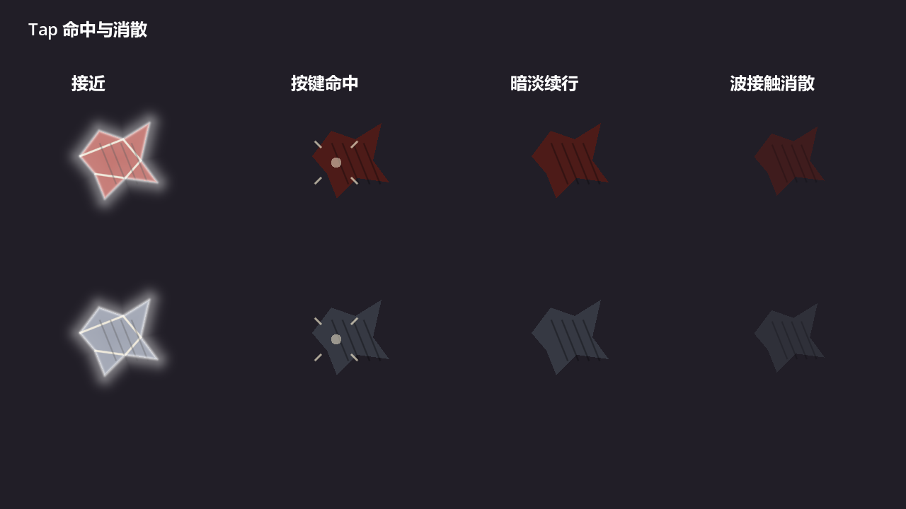
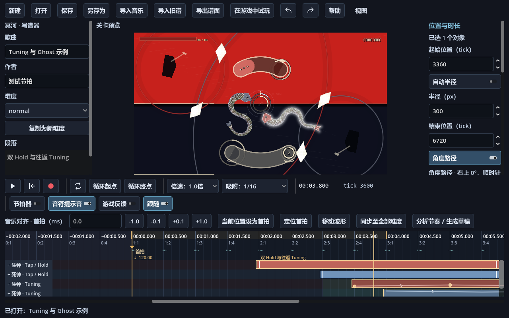

# Tap 两阶段反馈与 Tuning 半径

2026-09-10，工程源码变更；本轮未重新构建发布包。

## Tap

成功按键时隐藏圆形进度条、骨白轮廓及双押白光。命中印记由中心短闪和四条短线组成，在按键被接受的位置停留 0.12 秒，以平方曲线衰减。填色和内部暗纹继续沿原路径运动，填色 RGB 降为原来的 45%，不再随 Perfect 提亮。

真实声波接触后，本体停在领域层提供的 `contact.position`，0.12 秒内轻微收束并淡出。随后隐藏，仍由调度器原有 0.22 秒收尾窗口回收。Hold、Miss、声波传播、计分及 Replay 规则保持原样。

反馈按现有视觉时间求值，暂停不推进；Seek 在输入边界恢复命中位置，在波接触边界恢复死亡位置。大步定位补发历史接触后立即检查回收，避免留下已经结束的实例。重复通知不会重播，池复用清除命中和死亡时间。

### 美术接入

| 接口／约定 | 实现要求 |
| --- | --- |
| `play_timing_confirmed(grade)` | 成功按键的即时反馈，隐藏外层提示，保留移动本体；勿直接销毁节点 |
| `play_wave_contact(contact)` | 真实接触时的死亡动画，Host 已把本体固定到实际接触坐标 |
| `set_note_glow_time(seconds, time_to_hit)` | 当前绝对视觉时间；成功 Tap 不再恢复双押光 |
| `reset_for_pool()`、`prepare(view_model)` | 清除上一实例的反馈、可见性和时钟状态 |

音符以自身原点为中心，使用 1920×1080 设计像素。命中印记与本体分层，世界变换在按键接受时固定；正式怪物可替换填色与纹样，并在波接触接口接入死亡素材。灰盒没有新增动画资源管理层或额外 SubViewport。两段默认均为 0.12 秒，常量位于 `GrayboxNoteVisual`；更长的正式死亡动画需同时调整调度器收尾窗口。

## Tuning

单选 Tuning 后，关闭“自动半径”即可输入半径，初值取首段当前半径；箭头每次调整 1 px。半径是画面中心到轨道中心线的距离，整条路径共用一个值，生死两条独立设置。

`visual_radius_px` 在路径 Resource、投影滑条及编译表现字典中传递。JSON 缺失或 0 表示自动，正数表示自定义，格式版本不变。旧谱的自动模式保持原显示；自定义模式让不同跨度的分段位于同一圆周。输入负数／非有限数值会报错，稿件检查保留定位信息。

轨道、填充、引导点、起手预告和端点反馈共用新几何，轨道宽度、描边、端帽及字样尺寸保持原值；窗口尺寸变化由画布整体缩放。Hold 控制圈仍按原方向关联。半径不参与频率映射、角行程、理想输入、Replay 哈希和 Ghost 选点。

相纹亮度沿用游戏设置中的现有范围 35%～100%、默认 85%，没有增加第二个入口。

## 验证

- `tests/visual/run_tap_feedback_tests.gd`：普通／双押、生／死、Perfect／Good、提前／延后、印记固定、消散、重复事件、池复用，以及正式预览直接定位与连续播放对照。
- `tests/editor/run_tuning_radius_tests.gd`：旧谱、分段几何与节点接合、编译数据和理想输入不变、Replay 摘要与 Ghost 结果一致，以及属性、撤销、复制、保存、恢复和 ZIP 导入闭环。
- 现有输入、Tuning UI、Studio 预览和 Tap/Hold 白光测试用于回归。

上述两项新增测试均支持去掉 `--headless` 在真实 Compatibility 渲染器下运行，截图输出至 `builds/visual-review/tap-radius/`。包括 1280／1920 窗口下的 Tap 四阶段和写谱器半径属性、正式内嵌关卡画面。

结果：Tap 专项 137 项、半径专项 39 项全部通过；现有输入、Tuning UI／编排、Studio 预览、布局和白光回归通过。Godot 4.7.2 工程解析通过，真实 Compatibility 渲染无报错。

`run_domain_tests.gd` 的旧领域测试仍有 11/131、Tuning arc 24/101 项失败。隔离解包 HEAD 后复跑得到完全相同的 35 项失败；本轮保留这些已有问题。对比日志位于 `builds/tap-radius-final-0.log` 与 `builds/tap-radius-baseline-tests.log`。

