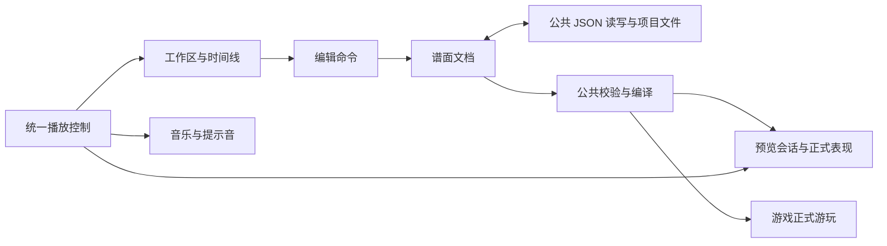

# 《冥河，冥河！》写谱器设计说明书

> 版本：1.2；日期：2026-09-08。状态：五轨 Tuning/Ghost 与 BOSS 增量已接入；旧游戏预览仍有过渡限制，尚未通过全部正式验收。
> 产品：Godot 4.7 制作的 Windows 独立写谱器；目标用户为谱师、主策划与关卡配置人员。
> 本文依据用户已确认方案编制，保留完整开发规格；各项实际进度与限制以 `Game/docs/chart-editor-progress.md` 为准，当前操作见 `Game/docs/chart-editor-guide.md`。
> 研究来源见[《写谱器调研与重构设计原则》](./《冥河，冥河！》写谱器调研与重构设计原则.md)；旧实现见[《MVP 写谱器架构》](./《冥河，冥河！》MVP写谱器架构.md)。新版开发以本文为准，后续用户决定优先。

## 1. 产品要求与首版边界

### 1.1 交付目标

谱师从音频文件出发，在一个应用中完成对齐、制谱、局部修正、自动预览和交付。整个过程不依赖 Godot 编辑器、场景树、Inspector、GDScript 或手写谱面文件。

简单直观通过一致操作、合理默认值和及时反馈实现。功能复杂度由菜单、上下文操作和高级属性组织，不能通过缺少必要功能来简化产品。

| 首版必须交付 | 后续版本，首版不实现 |
| --- | --- |
| Windows 独立程序；歌曲／难度管理、音频导入、元数据与节奏对齐 | macOS 等其他平台交付 |
| 生／死 Tap、Hold、Tuning 与 Ghost；完整选择、移动、复制、批量编辑、撤销 | 疾振编辑、Ghost 最终预测及计分接入 |
| 等秒距时间线、节拍网格、波形、段落、循环与保音高变速；节奏分析、Tap 草稿和 F/J 录制 | 完整自动编排、MIDI 导入、宏系统 |
| 内嵌关卡自动演示、暂停更新与任意时刻定位恢复 | 完整手动试玩、成绩与误差分析 |
| 选择内置主题、音符外观，配置基础配色 | 通用镜头、背景、VFX、角色演出事件编辑器 |
| JSON 共同协议、保存恢复、ZIP 交付、旧 Tap/Hold 迁移 | 联网协作、素材商店、任意脚本／场景导入 |

开发按阶段推进，但首版完成必须满足左列全部常规能力。Tuning 与 Ghost 的游戏侧正式预测和计分由另一位程序负责；写谱器当前增量约定见第 13 节，优先于本文初版的预留说明。

### 1.2 验收方式

验收以第 10 节示例乐句和第 11 节场景表为依据。每项记录实测结果，不用“功能按钮存在”代替可完成任务。音频质量与定位性能需要实际测量，不在文档阶段宣称已经达标。

## 2. 工作区与用户流程

### 2.1 界面结构

```text
┌────────────── 文件  编辑  谱面  音频  视图  帮助 ──────────────┐
│ 歌曲／难度／段落 │             关卡实时预览             │ 属性 │
│ 内置主题与外观   │      生界 ↘              ↖ 死界      │ 面板 │
│                 │          保持游戏画面比例            │      │
├───────── 播放  时间  倍速  循环  吸附  节拍器 ────────────────┤
│ 秒时间尺         00:02          00:03          00:04         │
│ 小节／拍尺       1.1            1.3            2.1           │
│ 波形与段落       ∿∿∿∿∿∿∿∿∿∿∿∿∿∿∿∿∿∿∿∿∿∿∿∿              │
│ BPM／拍号        120 / 4⁄4                     150           │
│ 生钟音符轨       ◆          ┣━━━━ Hold ━━━━┫                 │
│ 死钟音符轨            ◆            ◆                        │
├────────── 文件状态与选择摘要；可展开的问题列表 ────────────────┤
└───────────────────────────────────────────────────────────┘
```

**实现约定：**上／下分区及侧栏宽度可拖动；左栏、右栏、问题列表可折叠。首次打开以 1440×900 窗口为默认，适配至工作区可容纳大小；1280×720 仍须通过折叠侧栏完成全部操作。预览区按游戏画面比例留边，不拉伸变形。工具界面采用中性深色和清晰选中态，楚文化表现由关卡预览与素材承载。

首版只有生、死两条音符轨，Tap/Hold 不分行。颜色同时配合名称、形状与侧别符号，避免仅靠暗色区分死侧。轨道行高默认 64 个逻辑像素，可在视图设置中调整。波形单独成行，不能铺满音符区域干扰命中。

预览输入默认不接收 F/J 等游戏操作；快捷键由写谱工作区处理。预览上方标示自动演示、当前主题和预览可用状态。

### 2.2 从音频到交付

| 阶段 | 谱师操作 | 反馈与结果 |
| --- | --- | --- |
| 新建 | 选择项目目录，填写歌曲名、作者，选择音频 | 创建歌曲和默认 normal 难度；音频复制进项目，显示后台波形进度 |
| 对齐 | 设置 BPM，使用固定音乐对齐区输入毫秒、选点设首拍、拖首拍把手或开启移动波形 | 拖把手固定波形，拖波形固定网格；调整暂停并保留音频位置，松手一次提交 |
| 输入 | 空白点击 Tap、拖画 Hold，或 F/J＋游标步进 | 显示候选音符及音乐位置，提交后预览更新 |
| 修正 | 框选、移动、复制乐句、换侧、量化或修改共同属性 | 选区稳定，操作名称进入撤销历史，问题定位到具体对象 |
| 试听 | 空格播放，I/O/L 循环，调整倍率和提示音 | 音频、游标和自动演示同步，循环恢复持续状态 |
| 保存 | Ctrl+S；必要时另存为项目 | 保存当前编辑内容，即使尚有玩法错误；标题显示是否有未保存修改 |
| 交付 | 导出可玩包，选择全部或指定难度 | 检查所选难度和素材，打包 JSON 与音频；在游戏中加载验证 |

打开一个歌曲项目时可新增、重命名、复制、删除难度；复制难度生成新 chart_id，音符与组合 ID 在新谱内重新映射。切换难度先完成当前手势，保留各自的未保存内容、历史和视图状态；共享歌曲属性由歌曲级历史管理，音符／节奏由当前难度历史管理。历史面板清楚标识歌曲级与谱面级操作，撤销按钮默认作用于最近获得编辑焦点的作用域。

关闭项目、另开项目或退出前，如有未保存内容提供保存、放弃、取消。切换难度不弹保存问题。删除难度需确认，并支持在项目未关闭前撤销。

### 2.3 基础配置

首版主题下拉框读取内置预设目录。每个预设提供稳定键、显示名和缩略图，映射到游戏现有主题装配。内置 `default` 是实际注册的回退预设，不能只在文件里写一个不存在的键。

允许配置主题提供的五种基础颜色：生、死、素、墨、底纸；允许选择当前主题支持的音符 `visual_variant`。不暴露 PackedScene 路径、场景槽名称或通用脚本参数。配置面板按预设声明列出可选项，选区内不支持的外观选项不可应用。不存在的素材键显示问题，不静默替换后宣称预览一致。

## 3. 输入、选择与编辑规则

### 3.1 命中与手势

以下尺寸均为逻辑像素，随系统 UI 缩放处理。

1. 左键在空白音符轨按下，横向移动不足 6 像素视为点击；释放创建 Tap。达到阈值后进入 Hold 候选，起止取按下／当前位置较小和较大的音乐 tick。侧别始终取按下的轨道，不能拖画途中跳侧。
2. 命中已有音符时只选择或拖动，不删除。未选音符被点击后成为单选；点击多选中的一个保留整组，支持随后整体拖动。
3. Hold 头尾有 8 像素命中带，仅在已选 Hold 或悬停时明确显示把手；把手优先于身体。长度太短把手重叠时，离鼠标更近的端点优先，距离相同取尾；属性面板仍可精确编辑。
4. 拖动身体保持各音符相对 tick 间隔和自身长度。命中端点只调整该音符端点，不隐式拉伸整组；批量长度变化在属性面板操作。
5. 选区全部属于同侧时可拖到另一侧；含双侧音符的多选仅拖动时间，换侧使用“生死互换”命令，避免挤到同一轨道。
6. 拖动接近时间线左右边缘 24 像素时自动滚动；以鼠标距边缘的接近程度加速，离开边缘立即停止。暂停、播放均允许绘制或拖动，按下时固定起始 tick，移动期间基于当前视图映射定位。
7. Esc、丢失窗口焦点或捕获丢失均取消未提交手势；不产生历史。正常释放提交一次历史；无变化不占历史记录。

Hold 的最小长度是一个当前吸附步长；Alt 关闭吸附时为一个 tick。端点到达最短长度后停止，不穿越另一端、不自动换头尾或变 Tap。已有更短合法 Hold 不因切换吸附而被自动修改。

**修饰键优先级：**文本／数值编辑 > 弹窗／菜单 > 正在进行的手势 > 时间线操作 > 工作区快捷键。Shift 在按下时选择框选／增减选语义；Alt 在时间类手势中实时关闭吸附，两者可组合；Ctrl+滚轮优先缩放。Shift 按住命中音符时只增减选，本次不启动拖动。

### 3.2 快捷键与菜单

| 输入 | 行为 |
| --- | --- |
| 空格 | 播放／暂停；数值或文字输入期间不触发播放 |
| F / J | 暂停时输入生／死；按住并用方向键移动游标生成 Hold；释放键提交 |
| ← / → | 游标前后移动一个当前吸附步长；关闭吸附时一个 tick |
| PageUp / PageDown | 游标跳到上一／下一小节起点 |
| Home / End | 定位音频起点／声明的谱面尾点 |
| Shift+左键空白拖动 | 框选；选区与矩形相交即选中，保留原选择并加入命中对象 |
| Shift+点击对象 | 增减选；Ctrl+A 全选当前谱面的可编辑音符 |
| 中键拖动 / 滚轮 | 平移时间线／水平滚动；不改音乐播放位置 |
| Ctrl+滚轮 | 以鼠标下音频秒位置为锚点缩放 |
| Alt+放置或时间拖动 | 暂时关闭节拍吸附 |
| I / O / L | 在当前位置设置循环起点／终点，开关循环 |
| Delete / Backspace | 删除选中音符，不移动后续音符 |
| Ctrl+C / X / V | 复制／剪切／在游标处粘贴 |
| Ctrl+D | 紧接选区乐句范围重复一次 |
| Ctrl+M | 生死互换，保持时间与组合关系 |
| Q / Shift+Q | 量化头部并保长度／量化头尾 |
| Ctrl+Z / Ctrl+Shift+Z / Ctrl+Y | 撤销／重做／重做 |
| Ctrl+S / Ctrl+Shift+S | 保存项目／项目另存为 |
| Ctrl+O / Ctrl+N | 打开／新建歌曲项目 |
| Esc | 取消手势、关闭顶层菜单或清空音符选择，按上述顺序处理 |
| 右键 | 上下文菜单，显示操作及快捷键，不直接删除 |

播放时 F/J 不录音符、不注入游戏按键；不提供伪装成制谱的实时试玩。F/J 步进输入期间音频保持暂停；同时按住两键可建立双侧候选，释放各自键时提交，最终同 tick 音符不自动赋予判定分组。

所有快捷键均有菜单入口；首版提供快捷键列表与重设默认值，用户改键时检测重复绑定并要求解决，不静默抢占。以上为出厂默认。

### 3.3 吸附、复制与分组

吸附菜单直接显示四分、八分、十六分、三十二分、六十四分，以及八分／十六分三连音；其步长分别为 PPQ、PPQ/2、PPQ/4、PPQ/8、PPQ/16、PPQ/3、PPQ/6，默认十六分。导入 PPQ 无法整数表示的细分不可选，不能偷偷改 PPQ。格点以 tick 0 为原点，取最近点，恰好中间时取较晚点；秒位置先用公共时间映射反算为 tick，再吸附。网格显示根据缩放减少线条，不能因此改变实际吸附步长。

拖动多选时只吸附抓取音符的头部，其他音符沿用相同 delta_tick。关闭吸附后取最近整数 tick。量化头尾后若 Hold 太短，将尾点推进到最短有效长度，并在操作摘要中列出调整数量。

粘贴以原选区最早 tick 对齐当前吸附游标，保留相对 tick 和长度。重复以选区最晚尾点向后取整到吸附格点作为下一乐句起点；若仅选一个 Tap 或该点未晚于起点，则至少前进一个吸附步长。上下文“重复到游标”提供明确指定另一处位置的入口。复制、重复均产生新音符 ID。

双押的视觉同刻和逻辑分组分开：不同侧同 tick 音符可不分组；“组合为双押”仅用于正好两个同 tick、异侧音符，并显式设置 group_id。整组复制重映射 group_id、damage_group_id；仅复制部分组时清除复制品不完整的组引用，不修改原对象。导入已有 damage_group_id 不静默清除；高级分组面板展示并支持显式解除共享伤害关系。移动导致组关系不合法时保留编辑结果并定位问题，用户可撤销或解除组，不自动连带移动未选成员。

### 3.4 属性和错误反馈

属性使用中文标签；时间可按小节／拍、tick 或音频秒输入，提交后统一转换成 tick。Hold 明确显示头、尾、长度，编辑长度保持头不变。侧别和外观支持批量设置，多选不一致显示“多个值”；批量改头位置按选区最早头的目标值整体平移，批量长度设同一长度。Tap/Hold 类型转换需明确命令：Tap 转 Hold 使用一格长度，Hold 转 Tap 将长度清零。

event_id 只读，复制自动生成；组合字段在高级属性中编辑。Enter 或移出已完成字段提交一次修改，Esc 恢复；无效数值留在输入控件并标注原因，不提交到文档，也不重建控件导致焦点丢失。

同侧重叠、组合不合法等玩法问题允许留在编辑稿，通过描边与问题列表显示。删除、拖动不能为了通过校验擅自删除其他音符。

## 4. 时间、节奏与音频

### 4.1 唯一时间定义

定义 `T(x)` 为公共 TempoMap 从 tick 0 到有效 tick x 的有符号微秒积分，BPM 事件位于该有效 tick 轴。保持当前游戏语义：

```text
effective_tick = note.tick + chart_offset_ticks
audio_us = round(first_beat_offset_ms × 1000) + T(effective_tick)
hold_end_us = round(first_beat_offset_ms × 1000) + T(note.tick + duration_ticks + chart_offset_ticks)
```

`chart_offset_ticks` 作用于被求值的位置，不再平移 BPM 事件表，否则会改变旧谱含义。网格音符位置和段落用同一映射；BPM 编辑标记按事件的有效 tick 显示，不额外加一次 chart_offset_ticks。首拍偏移表示有效 tick 0 的音频位置；全谱偏移非零时，音符 tick 0 可处于别的位置，固定音乐对齐区同时显示两者帮助校对。

默认 PPQ=480、BPM=120、4/4，默认全谱偏移 0。首拍偏移允许有符号小数毫秒，导入保留到微秒转换精度。BPM 使用有限正数。小节编号从 1 开始，负 tick 用第 0 或负小节显示；拍号变化点从新小节开始，不满一小节的前段记作短小节。分母必须为 2 的幂且当前 PPQ 可精确表示一拍。

定位允许音频起点之前的预备区：从最早事件或 tick 0 所在位置再提前一个小节开始；负音频时间静音，时钟连续推进到音频零点。谱面尾点后的判定收尾由游戏规则完成，不通过增加隐藏音符实现。

初建谱面以音频长度反算尾点，向下取整为 tick；用户在其后编辑内容时自动扩展到最后尾点，若超出音乐则显示明确问题。结束位置也可在歌曲／谱面面板手动修改；变 BPM 后超出音乐的内容不自动裁剪。

### 4.1.1 音乐对齐操作

播放栏下固定显示首拍毫秒输入、±1／±0.1 ms、当前位置设首拍、定位首拍、移动波形和同步全部难度；选中音符不隐藏该区。输入允许正负小数，不限制在 ±30 秒内，未编辑时保留原始更高精度。

首拍有金色竖线、把手和时间标签。拖把手时波形固定；波形右键可将点击处设为首拍。默认拖波形定位播放头，开启高亮的“移动波形”模式后改为对齐：右拖 Δx 时首拍偏移减少 Δx / pixels_per_second 秒，同时视口起点增加相同的首拍变化量，使网格和音符位置固定。两种对齐拖动均不吸附节拍，Shift 将增量降至十分之一。

开始调整暂停试听并保留音频位置；候选只更新时间映射与绘制，松手后一次文档命令刷新正式预览，Esc／窗口失焦取消候选和视口变化。完成或取消后由用户继续播放。数值及拖把手不补偿视口，不修改音符 tick、Hold 长度、BPM、全谱偏移、设备补偿或音频文件。

首拍默认只写当前难度；显式“同步至全部难度”复制当前偏移，保留各自 BPM 和全谱偏移，作为一次歌曲级命令撤销恢复各自原值。保存、恢复及 ZIP 沿用既有 JSON 字段，无格式升级。

### 4.2 播放与循环

播放控制器维护音频秒位置，显示分:秒.毫秒；音乐和自动输入以同一个位置运行。它复用游戏“与音频起播对齐的单调时钟”思路，不逐帧累计 delta，也不让播放器观测抖动倒推判定。

暂停冻结位置；恢复从原位置继续，不倒计时。定位、循环、切换难度以及重新载入预览清除旧一轮瞬态状态。改变倍率保持音频源位置不变，重新锚定时钟速率。

I/O 以音频秒保存循环范围，与音符选择互不覆盖；终点必须大于起点，设定无效时提示并保持旧范围。循环区间采用 [I,O)，到 O 时定位到 I；O 上的音符在本轮不触发。拖尺期间保持拖动前的播放意图，松手后若原本播放则继续。

停止或到尾点保留当前位置；Home 显式回到音频零点。滚动时间线不改变游标；“跟随播放”默认开，手动滚动暂时关闭，可通过按钮恢复。

### 4.3 音频管线与保音高验证

外部音频由运行时 API 解码，支持 PCM WAV、Ogg Vorbis、MP3；遇到不支持的具体编码给出格式原因和转换建议，不能把“加载了波形”等同于加载歌曲成功。波形使用解码后数据建立多级峰值缓存，后台结果按当前音频身份接入，换歌不能显示旧结果。

BGM 只播放一份。主音乐、节拍器、音符提示音和游戏反馈分别有音量／静音控制。提示音在音符起手时播放，节拍器区分小节重拍；Hold 不逐帧触发提示音。切换音频后提示重新检查首拍和尾点，保留谱面供调整。

试听速率固定提供 0.5、0.75、1、1.25、1.5。首选验证方案为音乐播放器速率 r，加专用音乐总线 PitchShift 比例 1/r；1 倍旁路效果。节拍器和反馈不经过音乐反向移调总线，使用同一逻辑时刻调度，并统一处理输出与处理链延迟。

先使用 FFT 1024、oversampling 4 作为验证起点，记录各倍率的实际延迟与音质。设备补偿存应用设置；处理链延迟由音频适配测量并用于对齐，不能写进 first_beat_offset_ms。定位或循环时清除／重建旧处理尾音，防止上一位置残响错误混入。

验收使用脉冲、持续音、打击乐和实际歌曲：440 Hz 测试音主频误差目标不超过 1%；补偿后稳定提示偏差目标不超过 10 ms；测试 5 分钟时开头与末尾偏差之差不超过 5 ms。记录采样率、设备、缓冲和测量方法；音质不得明显爆音或使落点难以辨认。未达到要求须提交数据并修订处理方案，不降级为变调试听或声称完成保音高能力。这是开发早期技术验证，不是本文已确认的效果。

## 5. 实时预览的状态与行为

### 5.1 显示和数据版本

预览使用 SubViewport 显示正式游戏场景及素材，不使用逐帧截图。画面有自己渲染分辨率，调整预览窗口仅缩放显示，不改变关卡世界坐标、音符语义和判定。

文档每次提交增加内存编辑版本 revision，不写入正式音符。拖动期间时间线和预览显示候选版本，正式判定快照在提交后更新；候选更新每帧至多一次，过期计算结果不覆盖新的候选。Esc 后恢复正式版本及原播放意图；音乐对齐手势例外，取消后仍保持暂停，详见 4.1.1。

预览提供 `空项目、准备中、暂停、播放、定位中、内容不可预览` 六种可见状态。准备／定位中仍允许操纵时间线，音频暂不继续，最新定位请求替代旧请求；状态重建完成后恢复请求前的播放意图。屏幕明确显示正在更新，不能把旧画面当成新谱面。

| 事件 | 时间和音频 | 谱面及画面 |
| --- | --- | --- |
| 打开／切换难度 | 停止旧音频，切换到该难度记忆的游标，默认暂停 | 装载当前文档，重建对应时刻 |
| 暂停后修改 | 保持当前位置和暂停 | 刷新候选／新版本，包括持续 Hold |
| 播放中修改 | 更新时短暂进入准备态，保持源音频位置，完成后继续 | 新版本重建；不能同时存在两份 BGM |
| 拖动时间尺 | 进入定位态并临时停止音频；移动时显示目标画面 | 重建请求合并，释放后完成最新目标 |
| 往回跳／循环 | 更新播放锚点，清理音频旧缓冲 | 清除旧判定、声波与特效，再恢复目标状态 |
| BPM／偏移改变 | 固定音频秒位置 | 重新反算音乐位置，重建新时间映射下的状态 |
| 编辑稿有错误 | 保留编辑和保存，暂停预览音频 | 标明问题，停止自动演示；时间线仍显示全部内容，不播放旧快照 |
| 内容恢复合法 | 重新准备当前时刻，默认暂停 | 显示当前版本，用户按空格继续 |

“随时更新”指无需保存、重新启动或另开游戏。重建耗时必须显式显示，不能以保持过期画面掩盖。拖动过程中临时发生不合法布局时显示候选及问题；恢复合法候选后继续预览更新。

### 5.2 自动输入与历史状态恢复

自动演示通过正式输入／判定链执行：Tap 在目标起手时刻产生有效按下与释放；Hold 在头部按下，持续到尾点完成后释放。释放顺序、同刻输入次序和同侧相邻边界使用游戏规定，不能根据 UI 帧决定。输入流按逻辑时间排序，以确定性模拟处理，不因一帧跨过多个音符而漏判。

正式规则决定相邻 Tap 与 Hold 是否可演奏及间隔；编辑器复用校验结果，不自行发明更宽松判定。自动演示不能只涂亮音符、屏蔽 MISS 或伪造“全部完美”结果，必须触发编钟持续状态、声波和实际反馈。该运行会话不写玩家存档、奖励、成绩或正式 Replay 文件。

历史恢复先采用简单正确的路径：在目标前的初始时间重置模拟，按自动输入流无声快进到目标，纯时间动画直接求值；快进不向扬声器补播历史击打。尾点与正在持续状态必须重建，不能裁掉此前起手的 Hold。

波纹等有历史依赖的表现由游戏暴露可重建状态或确定性事件历史。GPU 粒子不能仅改时钟就宣称恢复；需要按受控时间推进、显式重置并恢复效果年龄，或改为可求值的时间表现。采用随机的表现保存会话种子，相同谱面和目标时间可重复得到同一预览。

性能实测后才增加稀疏状态检查点；初版不建立每帧大快照。通过已编译事件索引减少无事件时段的工作量，不能跳过会影响后续状态的输入。

## 6. 模块、数据流与共同接口

### 6.1 模块分工

| 模块 | 输入／输出与职责 | 不承担 |
| --- | --- | --- |
| Workspace 与 Timeline | 将鼠标／键盘转为语义操作；显示选择、候选、网格和问题 | 音符判定、文件编码 |
| EditorDocument | 当前歌曲／各难度内容、稳定 ID、工作副本和内存 revision | 控件状态、实时游戏状态 |
| Commands / History | add、remove、move、resize、set_properties 等；记录受影响对象前后值 | 每次鼠标移动复制整谱 |
| ChartCodec | JSON／领域数据双向转换，保留兼容未知数据，旧数据适配 | 读写控件、决定游戏玩法 |
| ProjectIO | 目录、音频复制、保存恢复、ZIP、旧资源归档 | 第二套谱面语义 |
| TempoMap / Compiler / Validator | 共用时间、语义编译、问题定位 | 依赖 UI 场景 |
| Transport / Audio | 唯一播放位置、暂停、定位、循环、速率、音频与补偿 | 重复生成游戏判定 |
| PreviewSession | 当前版本自动输入、模拟状态重建、正式表现嵌入 | 编辑原文档、保存游戏成绩 |



保留类型化 Resource 作为内部表示是允许的；JSON 不要求将领域代码全部改为 Dictionary。只维护一套语义转换和 TempoMap。历史采用增量记录，必要的大操作才保存受影响集合；不要保留已经不再使用的整谱历史路径形成双重状态。

### 6.2 新接口约定

以下是需要双方接入的新接口，名称为说明书约定；具体宿主可按项目 GDScript 风格封装，不要求创建同名抽象基类。

| 接口 | 最小输入／输出 | 行为 |
| --- | --- | --- |
| `decode_song(data)` / `decode_chart(data)` | JSON 对象 → 领域文档、兼容保留字段、问题列表 | 纯数据转换，不加载预览场景 |
| `encode_song(document)` / `encode_chart(document)` | 领域文档及保留字段 → JSON 对象 | 不从 UI 推断值，稳定序列化 |
| `compile_preview(document, preset)` | 工作内容 → 游戏编译结果、问题列表 | 使用公共时间与正式规则 |
| `load_preview(compiled, context, revision)` | 编译数据、主题／音频上下文、revision | 关闭旧会话；不自行起播 BGM |
| `update_preview(compiled, revision, audio_us)` | 新版本与源音频位置 | 重建当前位置，输出准备／完成状态 |
| `seek_preview(audio_us)` | 音频坐标整数微秒 | 恢复该时刻全部所需状态，无声处理历史 |
| `set_transport(playing, audio_us, rate)` | 播放意图、位置和速率 | 播放控制器统一分发，预览不维护第二个独立时钟 |
| `preview_status_changed` | 状态、revision、audio_us、问题列表 | UI 标示当前实际版本和准备状态 |

问题列表每项含严重程度、稳定问题代码、中文说明，以及可选 chart_id、event_id、tick／字段路径。文件／编译错误用同一可定位表达，不强制每种错误弹模态窗口。

上下文包含可用预设、规则版本和音频引用。应用与预览显示游戏规则／资源构建标识，便于识别与队友当前版本的差异；无需再建立一套哈希验签协议。JSON 的文件版本、内存 revision 和游戏规则版本是三个不同概念。

## 7. JSON 共同协议基础（v2 增量见第 13 节）

### 7.1 项目与交付包

```text
<项目目录>/
  song.json
  charts/normal.json
  audio/song.ogg
  editor/workspace.json
  legacy/                    # 仅导入旧谱时生成
```

UTF-8 JSON、两空格缩进、文件结尾换行。磁盘保存和 ZIP 交付使用同一语义与目录布局，ZIP 根目录直接为 song.json 等内容，不再包一层机器目录名。导出一个或多个难度时在包内生成对应谱面列表，不修改工作项目的列表。

音频和 JSON 引用统一相对项目根目录，以 `/` 分隔。工作保存包含编辑器状态和迁移归档；可玩 ZIP 排除 `editor/`、缓存和 `legacy/`。旧资源归档保留在工作项目，不作为游戏可执行内容。

文件名中的 difficulty_id 使用小写字母、数字、下划线和短横线，显示名可中文；用户重命名显示名不改稳定标识。项目文件总是读取歌曲文件的显式 charts 列表，不按目录扫描猜测正式难度。

### 7.2 字段表

`format_version=1` 是新 JSON 格式版本，独立于当前 `.tres` 的 schema_version。必填字段缺失是内容错误；下表默认值用于新建或明确标注为可选的字段，不用于静默填补已损坏的必填内容。

| 文件／层级 | 字段 | 类型、含义与约定 |
| --- | --- | --- |
| song 根 | `format`、`format_version` | 固定 `minghe-song` 与整数 1 |
| song 根 | `song_id`、`title`、`artist` | 字符串；song_id 稳定，标题／作者面向用户 |
| song 根 | `audio` | 项目内音频相对路径字符串 |
| song 根 | `charts` | 非空谱面引用数组，每项 `chart_id`、`difficulty_id`、`path` |
| chart 根 | `format`、`format_version` | 固定 `minghe-chart` 与整数 1 |
| chart 根 | `chart_id`、`song_id`、`difficulty_id` | 稳定字符串，和歌曲列表引用一致 |
| chart 根 | `difficulty_name`、`mapper` | 显示名、谱师名；可为空，不影响判定 |
| chart 根 | `timing`、`notes`、`sections`、`presentation` | 必填对象／数组；notes 和 sections 允许为空 |
| timing | `ppq` | 整数，沿用当前支持范围 24—3840，新建 480；修改 PPQ 不在首版普通操作中开放 |
| timing | `first_beat_offset_ms` | 有限数，音频有效 tick 0 的位置，正值表示更晚；新建 0 |
| timing | `chart_offset_ticks` | 整数，新建 0；按第 4 节保留旧谱含义 |
| timing | `end_tick` | 正整数，作者声明尾点，不早于最后事件尾部 |
| timing | `tempo_events` | `{tick:整数,bpm:正有限数}` 数组，必须有 tick 0，tick 不重复 |
| timing | `meter_events` | `{tick:整数,numerator:正整数,denominator:正整数}` 数组，必须有 tick 0；分母与 PPQ 约束见第 4 节 |
| note | `id`、`kind`、`affinity` | 稳定字符串；首版 kind 为 tap/hold，affinity 为 zhu/xuan |
| note | `tick`、`duration_ticks` | 整数；Tap 长度 0，Hold 长度正数；负 tick 可保留并提示预备段 |
| note | `group_id`、`damage_group_id` | 可选字符串，省略等同空；正式含义沿用游戏编译，不在 UI 中猜测 |
| note | `visual_variant` | 可选字符串，省略为 default，只影响外观 |
| section | `id`、`tick`、`name` | 稳定 ID、音乐位置、名称，不产生判定 |
| presentation | `theme_id` | 内置预设稳定键，首版注册 default |
| presentation | `palette_overrides` | 可选对象，键限 life/death/su/ink/paper，值 `#RRGGBBAA`；省略沿用预设 |

音符排序按 `(tick, affinity, id)`，affinity 顺序 zhu、xuan；时间事件按 tick，段落按 `(tick,id)`。ID 在各谱面内唯一，歌曲／谱面 ID 在项目内唯一。编码器稳定输出已知字段顺序和未知字段排序，不能因重开文件造成无意义重排。

`tail_requires_release` 已被当前游戏弃用，不进入新音符语义；旧值只存在归档。Hold 尾点自动完成，手动释放不是尾部判定要求。

### 7.3 完整样例

以下歌曲和谱面共同组成第 10 节测试乐句。`audio/song.ogg` 需放入一段至少 8 秒的测试音频；JSON 本身不携带音频字节。

**song.json**

```json
{
  "format": "minghe-song",
  "format_version": 1,
  "song_id": "editor_training",
  "title": "写谱器示例乐句",
  "artist": "测试节拍",
  "audio": "audio/song.ogg",
  "charts": [
    {
      "chart_id": "editor_training_normal",
      "difficulty_id": "normal",
      "path": "charts/normal.json"
    }
  ]
}
```

**charts/normal.json**

```json
{
  "format": "minghe-chart",
  "format_version": 1,
  "chart_id": "editor_training_normal",
  "song_id": "editor_training",
  "difficulty_id": "normal",
  "difficulty_name": "示例",
  "mapper": "谱师",
  "timing": {
    "ppq": 480,
    "first_beat_offset_ms": 2000,
    "chart_offset_ticks": 0,
    "end_tick": 5760,
    "tempo_events": [
      { "tick": 0, "bpm": 120 },
      { "tick": 1920, "bpm": 150 }
    ],
    "meter_events": [
      { "tick": 0, "numerator": 4, "denominator": 4 },
      { "tick": 3840, "numerator": 3, "denominator": 4 }
    ]
  },
  "notes": [
    { "id": "n01", "kind": "tap", "affinity": "zhu", "tick": 0, "duration_ticks": 0 },
    { "id": "n02", "kind": "tap", "affinity": "xuan", "tick": 480, "duration_ticks": 0 },
    { "id": "n03", "kind": "tap", "affinity": "zhu", "tick": 960, "duration_ticks": 0, "group_id": "g01", "damage_group_id": "g01" },
    { "id": "n04", "kind": "tap", "affinity": "xuan", "tick": 960, "duration_ticks": 0, "group_id": "g01", "damage_group_id": "g01" },
    { "id": "n05", "kind": "hold", "affinity": "zhu", "tick": 1440, "duration_ticks": 960, "visual_variant": "default" },
    { "id": "n06", "kind": "tap", "affinity": "xuan", "tick": 1920, "duration_ticks": 0 },
    { "id": "n07", "kind": "tap", "affinity": "zhu", "tick": 2880, "duration_ticks": 0 },
    { "id": "n08", "kind": "hold", "affinity": "xuan", "tick": 3360, "duration_ticks": 960 }
  ],
  "sections": [
    { "id": "s01", "tick": 0, "name": "交替与双押" },
    { "id": "s02", "tick": 1920, "name": "变速与 Hold" },
    { "id": "s03", "tick": 3840, "name": "三拍段" }
  ],
  "presentation": {
    "theme_id": "default"
  }
}
```

### 7.4 扩展与适配

保留 note 下可选 `behaviors` 对象作为命名行为扩展位置；当前普通 Tap/Hold 不输出该字段。未来每个行为键对应具体定义的参数对象，并说明时间是相对头部还是绝对 tick；首版不指定调频行为键和内部字段，也不把判定行为塞入外观键。新游戏若最终采用独立 kind，也可增加新类型；不得把旧 kind 的含义悄悄改变。

编辑器理解格式但遇到不支持的 kind 或 behavior 时，保持原始对象、以只读标记显示位置及不支持提示；可保存原稿，不能将其当普通 Hold 自动演示或导出成已支持的可玩包。普通兼容未知字段保留在原对象上，修改已知字段不丢失它们。无法理解的 format_version 保持原文件不写入，提供说明。

JSON 字符串类型映射到当前 GameplayTypes 枚举；时间／音符转换为 SongChart、NoteEvent 等，首拍偏移从当前谱面 timing 传给该运行会话的 SongDefinition／编译上下文。不会为了预览一个难度改写其他难度的共享歌曲状态。主题键通过预设表解析 StageVisualTheme，配色覆盖只作用于本会话副本。

演出由主题提供默认预设；首版不引入可编辑的自由 ShowCue JSON。关卡奖励、解锁和正式流程继续由游戏层配置，不由谱面文件越权决定。

## 8. 保存、迁移与交付

### 8.1 保存和恢复

Ctrl+S 保存项目全部有修改的文档。工作区状态与音符数据分开，workspace.json 保存格式版本、当前难度、各难度游标／缩放／滚动／循环／折叠状态，不存音符和判定。音频输出校准、快捷键属于应用设置，不跟谱面传给别人。

保存允许存在玩法冲突，但不能把尚未提交的无效数值文本当作正式字段。写文件先写同目录临时文件，成功后替换原文件；多文件操作先保存新增／修改的谱面，最后更新歌曲清单，删除不用文件延后清理。保留上一版清单及本次受影响文件用于失败恢复即可，不照搬旧版复杂验签链路。失败时保留 dirty 标记并显示可操作原因。

每 30 秒且有变更时保存恢复稿，正常退出并成功保存后清除对应旧恢复稿；下次打开显示恢复稿时间、原文件时间，允许恢复副本或忽略。缓存可删除后重建。另存为复制音频和所需文件，迁移归档一并保留，新的根目录不引用旧电脑绝对路径。

### 8.2 旧谱迁移

通过“导入旧关卡”选择 StageDefinition 或成套 SongChart／SongDefinition。先解析路径依赖，再读取内容，绕开当前工作区先检查空资源的断点；不要求用户先在 Godot 中打开一次。

导入前选择新的目标目录。支持的歌曲、时间表、Tap/Hold、段落与分组转成新文档；旧歌曲 offset 复制到该谱面 timing，chart_offset_ticks 原样保留，时间表不额外平移。旧谱缺失 tick 0 拍号时显式补默认 4/4 并在导入报告说明。有效 JSON 内容使用新格式版本 1，与旧 schema 编号无关。

其余旧调频、素音、疾振、演出及无法映射的主题对象原样归档到 legacy，保留相关 `.tres`、引用的外部资源路径清单和导入报告。对源工程中可读的内容资源按原相对目录复制；不复制整套游戏程序作为运行依赖。无法复制的依赖逐项报告，不能声称归档完整。原资源字节不重写、不进行有损重新序列化。

报告分为已转换、仅归档、缺失三类。只归档的旧机制不进入新版预览或可玩 JSON；导入界面要求明确确认这个范围后创建新工程。当前只有 Tap/Hold 的测试关可用于直接对比迁移前后；混合关不能宣称全关玩法等价。

### 8.3 导出与游戏加载

工作稿可以保存；“导出可玩包”对选择的难度检查公共游戏语义、资源存在、引用和格式支持。错误可定位且阻止该包生成；警告允许导出并列在摘要。取消导出保留工作稿，不能强制删除音符以通过检查。

ZIP 包含歌曲清单、所选 JSON、音频及明确允许的资源；默认不含 legacy、editor、波形缓存。导出摘要注明所选难度，以及迁移项目中未进入可玩内容的旧机制。游戏使用相同 ChartCodec 读取，不把 JSON 手工转换成另一份独立维护的 `.tres` 真相。

## 9. 开发、发布和协作

正式程序开发前在 `/Game` 的双方约定集成基线上创建 `editor` 分支。若已有同名分支，先检查其提交与工作区；不删除、重置或覆盖已有改动。本文编制不执行 Git 分支修改；Docs 不属于 Game 仓库，不能塞入 Game 提交。

继续使用一个代码库共享领域和表现。为独立应用设置专用启动入口和 Windows 导出配置：选择写谱器模式时直接进入工作区，关闭菜单路由和玩家存档等应用副作用，同时保留共享输入／资源服务中预览必需的部分。构建需包括工具和预览资源，不能沿用当前排除 src/tools、scenes/tools 的游戏过滤规则。

| 阶段 | 完成物 | 进入下一阶段的证据 |
| --- | --- | --- |
| A 共同基础 | JSON 编解码及游戏适配、时间样例、保音高与 Hold 定位验证 | 同份谱面时间一致；音频测量记录；中段 Hold 可重建 |
| B 独立工作区 | 歌曲／难度、导入音频、波形、时间线与内嵌预览 | 独立入口完成建谱和自动预览，不依赖 EditorPlugin |
| C 完整编辑 | 全部手势、属性、多选、批量编辑、历史与快捷键 | 第 10 节乐句可全程由 UI 完成，取消／撤销正确 |
| D 文件与交付 | 保存恢复、旧谱迁移、ZIP、Windows 发布 | 无 Godot 环境可使用；游戏加载包后结果一致 |

写谱器侧负责 UI、编辑文档／命令、音频工具、文件管理；游戏侧负责正式语义、编译、判定和表现。双方共同接入第 6 节协议，预览不另写一套玩法内核。实现前通过样例明确共同接口，不要求队友完成调频才能制作 Tap/Hold。

版本间对照记录游戏规则和素材构建标识。遇到队友改变 Hold、分组或时序语义，应更新说明书、转换样例及验收预期；不能只更新一边代码。性能优化以热点测量为依据，优先可见范围绘制、增量更新和事件索引，不预建插件框架或海量检查点。

## 10. 贯穿示例乐句

使用第 7 节 JSON 对应乐句，准备至少 8 秒测试音频，在以下秒位置放置清晰音频参考点。默认首拍 2 秒，初始 120 BPM，tick 1920 改为 150 BPM。

| 对象 | 操作／音符 | tick | 期望音频时间 |
| --- | --- | --- | --- |
| n01 | 生 Tap | 0 | 2.000 s |
| n02 | 死 Tap | 480 | 2.500 s |
| n03/n04 | 双侧 Tap，显式组合 g01 | 960 | 3.000 s |
| n05 | 生 Hold | 1440 → 2400 | 3.500 → 4.400 s，持续 0.900 s |
| n06 | 死 Tap，位于变速点 | 1920 | 4.000 s |
| n07 | 生 Tap | 2880 | 4.800 s |
| n08 | 死 Hold，跨拍号变化 | 3360 → 4320 | 5.200 → 6.000 s |
| 拍号变化 | 4/4 → 3/4 | 3840 | 5.600 s，小节 3 的起点 |
| 谱面尾点 | end_tick | 5760 | 7.200 s |

实际 UI 练习步骤：

1. 新建项目，导入测试音频，设置首拍 2000 ms；建立 BPM／拍号变化和段落。
2. 点击建立交替 Tap；F/J 同刻输入双侧 Tap，再用上下文“组合为双押”。
3. 在生轨从 tick 1440 拖到 2400，生成跨变速 Hold；在死轨建立第二条 Hold。
4. Shift 框选双押，拖动其中一个到 tick 1200，确认两者一起移动；撤销一次恢复 tick 960。
5. 复制双押到 tick 4800，确认新 ID 和新组；撤销，恢复基准八音符谱面。
6. 调整 n05 尾点再 Esc，确认音符与历史不变；量化测试后撤销到基准。
7. 定位 4.200 s，应看到 n05 仍在持续；设 I=3.250、O=4.600，反复循环没有丢 Hold 或残留声波。
8. 以各倍率试听；暂停时换主题／改音符，再恢复原稿，确认预览及时更新。
9. 保存并重开；导出 normal 包到另一个目录，用游戏加载，比较全部期望起手与尾点。

补充全谱偏移测试：将 chart_offset_ticks 改为 480，n05 的有效头尾变为 1920→2880，应为 4.000→4.800 s，长度 0.800 s。该结果不同于简单把旧头尾都加 0.5 秒，专门用于发现变速迁移错误。撤销后重新回到基准。

## 11. 验收矩阵

| 编号 | 场景 | 通过条件 |
| --- | --- | --- |
| UX-01 | 无 Godot 环境首次使用 | 可导入音频、完成示例谱面并导出；无需改源文件 |
| UX-02 | 单工具点击／拖画 | 小抖动仍为 Tap；向前／后拖画 Hold 均正确；点击已有音符不删除 |
| UX-03 | 选择与批量 | 多选拖动保持组；端点调整规则明确；部分组复制不产生悬空组引用 |
| UX-04 | 焦点与取消 | 属性输入不失焦；文字空格不播放；Esc／失焦取消手势且不添历史 |
| UX-05 | 全操作历史 | 创建、删除、移动、改属性、复制、量化可撤销重做，恢复稳定 ID 与语义 |
| TM-01 | 示例时间与全谱偏移 | 第 10 节全部值与公共 TempoMap 一致，导出加载后仍一致 |
| TM-02 | 拍号与缩放 | 变拍网格正确；隐藏细网格不改变吸附；关闭吸附仍写整数 tick |
| PV-01 | Hold 中段定位 | 暂停、正向、后退、循环均重建正确持续状态，无历史音效补播 |
| PV-02 | 实时修改 | 不保存也能更新；旧 revision 不能覆盖新画面；音频始终单份 |
| PV-03 | 无效编辑稿 | 可保存、重开、修正；预览标错，不静默忽略音符或播放旧稿 |
| AU-01 | 倍速与同步 | 第 4.3 节测量与试听要求通过；音高和音频位置不混为一谈 |
| AU-02 | 更换／缺失音频 | 波形不会串歌；能定位新文件；未对齐风险明确提示，谱面不被清空 |
| IO-01 | 保存与恢复 | 正常保存、失败重试、恢复副本、另存为均不丢内容；不要求玩法无错才能保存 |
| IO-02 | 目录／ZIP | 换目录或电脑音频可找到；选择导出难度正确；缓存和旧归档不进入可玩包 |
| IO-03 | JSON 往返 | 已知语义和兼容未知字段保留；重大版本不有损覆盖 |
| MG-01 | 旧谱导入 | 路径式关卡可解析；Tap/Hold 时间与分组保持；旧内容归档可核对，原文件不变 |
| PF-01 | 密集谱面操作 | 5 分钟 10000 音符测试谱，在 1920×1080 下检查缩放、框选、拖动；记录 CPU/GPU、分辨率及耗时 |
| PF-02 | 预览恢复开销 | 分别测歌曲开头、中段、末尾定位；记录普通更新与完整重建耗时，不用卡住界面隐藏准备过程 |

PF-01 的操作反馈目标为 100 ms 内出现候选／状态变化；不把完整复杂场景重建也虚报成同一指标。预览 60 fps 为正常播放目标，记录达到目标的测试环境；低配置可降低预览渲染分辨率，不能改变判定时间或抽掉必要音符。

单元测试覆盖时间转换、编解码、命令逆操作与引用映射；交互测试覆盖真实鼠标／键盘流程；音频验证用可复测信号和实际音乐；发布检查在无 Godot 编辑器环境执行。测试只运行与写谱器及共享接入直接相关内容，不额外导出正式游戏。

## 12. 成熟工具经验与维护约定

| 借鉴来源 | 本说明书落点 |
| --- | --- |
| [ArrowVortex](https://github.com/uvcat7/ArrowVortex)、[GrooveAuthor](https://github.com/PerryAsleep/GrooveAuthor) | 乐句选区操作、节拍导航、增量历史、编辑时间与显示方式分开 |
| [SMEditor 基础指南](https://github.com/tillvit/smeditor/blob/master/guide/basic-guide.md) | 导入—对齐—输入—试听连续流程，鼠标与键盘生成 Hold |
| [Moonscraper](https://github.com/FireFox2000000/Moonscraper-Chart-Editor) | 歌曲级与谱面级职责、批量命令与段落导航 |
| [ArcCreate EventCommand](https://github.com/Arcthesia/ArcCreate/blob/trunk/Assets/Scripts/Compose/History/Commands/EventCommand.cs) | 编辑命令只记录必要对象，复用 Gameplay 服务 |
| [Phiedit 2573](https://github.com/Chengxuxiaoyuan-2573/Phiedit-2573) | 缩短局部试听和修改往返，选区与历史分组 |
| [MajdataEdit](https://github.com/LingFeng-bbben/MajdataEdit)、[MajdataView](https://github.com/LingFeng-bbben/MajdataView) | 编辑与预览职责分离；本项目不照搬跨引擎部署 |
| [Godot Viewports](https://docs.godotengine.org/en/stable/tutorials/rendering/viewports.html) | 内嵌实时渲染 |
| [Godot PitchShift](https://docs.godotengine.org/en/stable/classes/class_audioeffectpitchshift.html) | 保音高方案验证及 FFT 延迟权衡 |
| [Godot 运行时文件加载](https://docs.godotengine.org/en/stable/tutorials/io/runtime_file_loading_and_saving.html) | 独立应用导入外部音频 |

开始写谱器工作时先阅读本文范围、交互、时间和协议章节。发生需求变化时修改相应条款与验收编号，在版本记录写明原因；不能只在聊天或代码注释中改变正式约定。研究文档提供依据，旧架构描述历史，均不覆盖本文已确定规则。

| 版本 | 日期 | 说明 |
| --- | --- | --- |
| 1.0 | 2026-09-06 | 根据用户确认方案，确定独立 Windows 写谱器、单工具 Tap/Hold、实时预览、保音高试听和 JSON v1 协议；当前仅完成规格文档，程序待开发。 |


## 13. 五轨、Tuning、Ghost 与 BOSS 增量（1.2）

本节覆盖初版将调频与素音列为预留功能的条款；不改变时间协议及 Tap/Hold 玩法。

**产品要求：**固定五轨为生／死 Tap/Hold、生／死 Tuning、Ghost。轨道可调整行高、折叠和垂直浏览，下方分区最低高度保持原值。Tuning 在双 Hold 交集中拖画并自动绑定同侧所属 Hold 和另一侧支持 Hold；多个节点允许不等时长往返。角度编辑用圆周把手、节点时间与数值输入，固定右上 0°、顺时针正，沿短弧。Ghost 时间点表示一批的命中时刻，数量 1～16，可同刻多批。BOSS 仅标记 Tap/Hold/Ghost 来源。

**实现约定：**以 SongChart 为唯一内存谱面，新增类型化路径、节点及 Ghost 批次，谱面 JSON v2、歌曲 v1；保留未知字段并读取旧 v1。移动父对象带动所属子对象，共同 Ghost 只有双方都移动才跟随。缩短/删除影响关联时提供保留问题稿、删除受影响内容、取消。完整复制重映射 ID，部分复制按目标位置匹配。BOSS 不触发玩法编译。

当前角度编排受旧几何跨度及累计频差限制，不钳制假装成功；集中适配器临时投影旧滑条和素音给正式模拟。当前预览不代表连续多节点最终表现，也不代表 Ghost 理想预测、随机选点、共同等级及独立计分。完整操作、字段表和贯穿样例见 [Tuning/Ghost 编排](../../Game/docs/chart-editor-tuning.md)。

**验收标准：**以生 Hold 2～8 秒、死 Hold 3～9 秒；生 Tuning 3.5/5/7 秒，死 Tuning 4/5.5/7.5 秒；Ghost 4.5 秒×2、6 秒×3（BOSS）贯穿创建、节点编辑、共享移动、影响删除、撤销、v2 往返、恢复和游戏共享入口。不得通过改变正式规则、遗漏音符或减少批次数使测试通过。验证结果及尚未达标的完整恢复性能见 [本轮验证](../../Game/docs/chart-editor-tuning-validation.md)。
